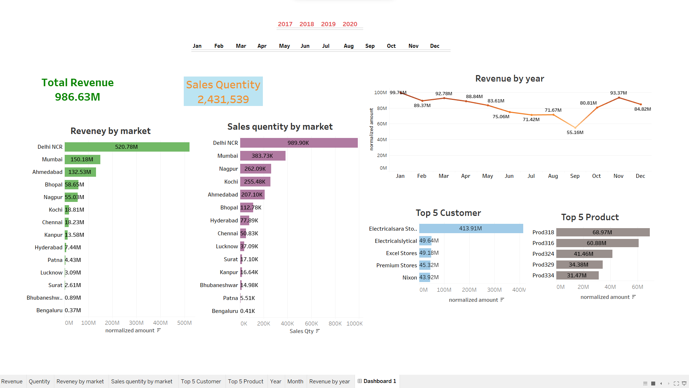

# Sales Insights Tableau Data Analysis Project

## Overview
This project is focused on analyzing and visualizing sales data using Tableau. The goal is to generate actionable insights that can improve business decision-making by identifying sales trends, performance metrics, and customer behaviors.

## Demo

## Key Features:
- **Data Cleaning & Preparation**: Sales data is cleaned and preprocessed for optimal analysis.
- **Interactive Dashboards**: Multiple dashboards showcase KPIs such as total sales, region-wise performance, product analysis, and customer segmentation.
- **Advanced Visualizations**: Includes charts, graphs, and maps for deeper insights and trend analysis.
- **Data-Driven Decision Making**: Helps businesses understand sales patterns and improve strategies.

## Technologies Used:
- Tableau for Data Visualization
- SQL for Datebase

## How to Use:
1. Clone the repository.
2. Open the Tableau workbook provided.
3. Explore the dashboards and interact with the filters for deeper insights.

## Conclusion:
This project empowers users with data-driven insights into their sales performance, helping enhance productivity and business outcomes.

